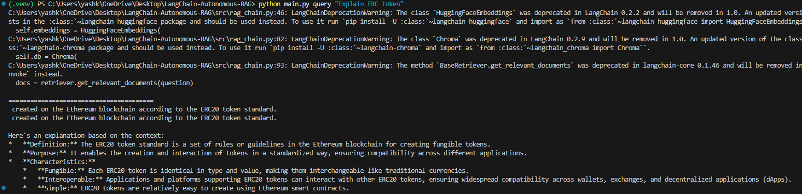
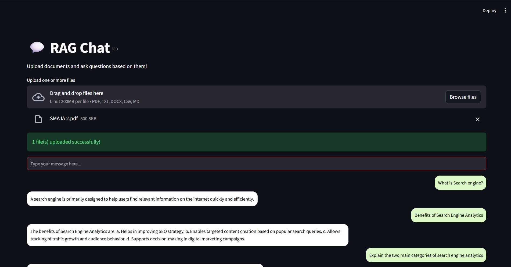

# Autonomous RAG Chat Project

This project implements a **Retrieval-Augmented Generation (RAG)** system using **LangChain**, **ChromaDB**, and **Gemini API**. Users can upload documents and query them through a **CLI** or a **Streamlit-based UI**.

---

## Features

- Upload multiple documents (`pdf`, `txt`, `docx`, `csv`, `md`) via UI.
- Build a **vectorstore** from uploaded documents.
- Ask questions and receive **detailed, tutor-like answers** using Gemini API.
- CLI and UI support for querying the RAG system.

---

## Project Structure

```
LangChain-Autonomous-RAG/
│── README.MD
│── requirements.txt
│── .env
│── app.py                # Streamlit UI
│── main.py               # CLI interface
│
├── data/
│   ├── raw/              # Uploaded documents
│   └── vectorstore/      # Chroma vectorstore
│
├── screenshots/         # Project screenshots
│   ├── CLIoutput.png
│   └── Streamlitui.png
│
└── src/
    ├── ingestion.py     # CSV ingestion to Chroma (optional)
    ├── rag_chain.py     # Main RAG class and query logic
    └── utils.py         # Utility functions
```

---

## Setup Instructions

1. Clone the repository:

```bash
git clone <your-repo-url>
cd LangChain-Autonomous-RAG
```

2. Create a virtual environment and activate it:

```bash
python -m venv .venv
# Windows
.\.venv\Scripts\activate
# Linux / Mac
source .venv/bin/activate
```

3. Install requirements:

```bash
pip install -r requirements.txt
```

4. Add `.env` file in the root with your Gemini API key:

```
GEMINI_API_KEY=your_api_key_here
```

---

## Usage

### 1. CLI

Build vectorstore from documents:

```bash
python main.py build
```

Query RAG system:

```bash
python main.py query "Your question here" --k 3
```

### 2. Streamlit UI

Run the Streamlit app:

```bash
streamlit run app.py
```

- Upload documents using the uploader.
- Ask questions in the chat box.
- Answers appear in a chat interface.

---

## Screenshots

### CLI Output


### Streamlit UI

---

## Notes

- Supports multiple file types: `pdf`, `txt`, `docx`, `csv`, `md`.
- Vectorstore is built once per session for performance.
- Deprecated LangChain warnings are suppressed in code.
- Gemini API is used for high-quality natural language answers.

---

## Author

Yash Kashte

